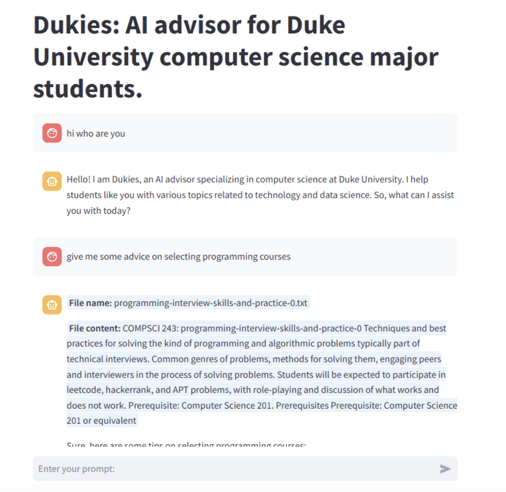

# Duke AI Advisor

## Overview

Duke AI Advisor is an AI-powered course selection assistant designed for Duke University students. It leverages advanced large language models (LLMs) to help students navigate course options efficiently.

## Table of Contents

- [Project Structure](#project-structure)
- [Quick Deployment](#quick-deployment)
- [Technical Details](#technical-details)
- [API Integration](#api-integration)
- [中文介绍](#%E4%B8%AD%E6%96%87%E4%BB%8B%E7%BB%8D)

## UI Demo


## Project Structure

```
.
├── 1.web_scrap
│   ├── course_page.ipynb
│   └── professor_page.ipynb
├── 2.data_preprocess
│   ├── batch_cs_courses.jsonl
│   ├── batch_cs_courses_output.jsonl
│   ├── batch_cs_professor.jsonl
│   ├── batch_cs_professor_output.jsonl
│   ├── batch_ece_courses.jsonl
│   ├── batch_ece_courses_output.jsonl
│   ├── batch_ece_professor.jsonl
│   ├── batch_ece_professor_output.jsonl
│   ├── cs_courses.jsonl
│   ├── cs_professor.jsonl
│   ├── ece_courses.jsonl
│   ├── ece_professor.jsonl
│   └── get_questions.ipynb
├── 3.implementation
│   ├── database_create.ipynb
│   ├── dukies.db
│   ├── milvus_demo.db
│   ├── milvus_test.ipynb
│   └── pipeline.ipynb
├── 4.deployment
│   ├── debug_frontend.py
│   ├── fastapi_v1.py
│   └── frontend_v1.py
├── README.md
├── data
│   ├── finetune_data
│   └── rag_data
├── fine_tune
│   └── mac
├── project_structure.txt
└── requirements.txt
```

## Quick Deployment

### Environment Setup

```sh
pip install -r requirements.txt
```

### Local Deployment

#### Backend

```sh
cd deployment/back_end  
uvicorn fastapi_v1:app --reload  
```

#### Frontend

```sh
streamlit run deployment/debug_frontend.py
```

## Technical Details

- **Web Scraping:** We utilized **Beautiful Soup** and **Selenium** to crawl and collect all course and professor information from Duke's ECE and CS departments.
- **Data Processing:** The raw data was transformed and cleaned to align with LLM training formats.
- **LLM Fine-Tuning:** We fine-tuned LLMs using **LoRA (Low-Rank Adaptation)** to improve their recommendation accuracy.
- **Vector Database:** We implemented **Milvus** to create a vector database for efficient information retrieval.
- **RAG System:** A complete **Retrieval-Augmented Generation (RAG) system** was built using **retriever and reranker models** to ensure precise responses.
- **Backend:** The backend is powered by **FastAPI**, an asynchronous web framework that ensures fast responses.
- **Frontend:** The frontend is developed using **Streamlit**, a lightweight and efficient web framework.
- **API Integration:** The system supports **API calls** to integrate course recommendations directly into users' calendars.

## API Integration

The model provides an API endpoint that allows users to interact with the recommendation system programmatically. Users can fetch course recommendations and integrate them into their personal calendars based on their preferences.

---

## 中文介绍

### 项目概述

Duke AI Advisor 是一个基于大型语言模型（LLM）的智能选课助手，旨在帮助 Duke 学生更高效地选择合适的课程。

### 项目结构

```
.
├── 1.web_scrap
│   ├── course_page.ipynb
│   └── professor_page.ipynb
├── 2.data_preprocess
│   ├── batch_cs_courses.jsonl
│   ├── batch_cs_courses_output.jsonl
│   ├── batch_cs_professor.jsonl
│   ├── batch_cs_professor_output.jsonl
│   ├── batch_ece_courses.jsonl
│   ├── batch_ece_courses_output.jsonl
│   ├── batch_ece_professor.jsonl
│   ├── batch_ece_professor_output.jsonl
│   ├── cs_courses.jsonl
│   ├── cs_professor.jsonl
│   ├── ece_courses.jsonl
│   ├── ece_professor.jsonl
│   └── get_questions.ipynb
├── 3.implementation
│   ├── database_create.ipynb
│   ├── dukies.db
│   ├── milvus_demo.db
│   ├── milvus_test.ipynb
│   └── pipeline.ipynb
├── 4.deployment
│   ├── debug_frontend.py
│   ├── fastapi_v1.py
│   └── frontend_v1.py
├── README.md
├── data
│   ├── finetune_data
│   └── rag_data
├── fine_tune
│   └── mac
├── project_structure.txt
└── requirements.txt
```

### 快速部署

#### 环境设置

```sh
pip install -r requirements.txt
```

#### 本地部署

##### 后端

```sh
cd deployment/back_end  
uvicorn fastapi_v1:app --reload  
```

##### 前端

```sh
streamlit run deployment/debug_frontend.py
```

### 技术细节

- **网络爬虫：** 使用 **Beautiful Soup** 和 **Selenium** 爬取 Duke ECE 和 CS 系的所有课程及教授信息。
- **数据处理：** 清洗并转换数据，使其符合 LLM 训练格式。
- **LLM 微调：** 采用 **LoRA (Low-Rank Adaptation)** 技术微调 LLM，以提升选课推荐的准确性。
- **向量数据库：** 采用 **Milvus** 构建高效的向量数据库。
- **RAG 系统：** 结合 **retriever 和 reranker 模型**，打造精准的 **检索增强生成 (RAG) 系统**，确保 LLM 生成的答案准确无误。
- **后端：** 使用 **FastAPI** 构建支持异步的高效后端。
- **前端：** 采用 **Streamlit** 搭建轻量级交互界面。
- **API 集成：** 允许用户通过 API 获取课程推荐，并将其直接添加到个人日历。

---

Duke AI Advisor 结合了最前沿的 AI 技术，致力于为 Duke 学生提供智能、高效的选课辅助工具。🚀

